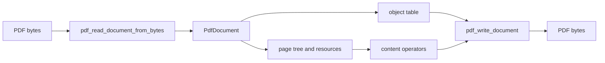

# pdflite

`bobzhang/pdflite` is a byte-oriented PDF toolkit for MoonBit. The root
package exposes the public document model, object parser/writer, page tree
helpers, content operators, text extraction, filters, images, fonts, encryption,
and high-level read/write entry points.



Use this package when callers need a complete in-memory PDF document. Use the
subpackages for narrower concerns such as byte primitives, transforms, Flate,
dates, low-level cryptography, async file IO, or Markdown extraction.

## What This Package Owns

- The public `PdfDocument` representation and its object table.
- PDF syntax objects such as arrays, dictionaries, streams, names, strings,
  numbers, booleans, nulls, and indirect references.
- Readers for headers, trailers, classic xref tables, xref streams, object
  streams, damaged-startxref reconstruction, revisions, and encrypted inputs.
- Writers for classic xref tables, xref streams, compressed xref streams,
  generated trailer IDs, incremental updates, and encrypted outputs.
- Page-tree construction, page queries, resource renumbering, merge/extract
  helpers, bookmarks, destinations, annotations, optional content groups, and
  content stream operators.
- Text/font/image helpers that need the full document graph.

## Pedantic Boundaries

- PDF byte data stays byte-oriented. `PdfBytes` is `Bytes`; `PdfName` and
  `PdfString` store raw bytes until an explicit text-decoding API is used.
- Object numbers are one-based in normal document allocation. Missing or
  deferred objects are represented explicitly instead of being guessed.
- Public parsing and writing APIs raise `PdfError` for typed failure classes.
  Tests should assert concrete errors where the input class is stable.
- Methods that mutate a document mutate the in-memory object table directly.
  Functional wrapper APIs, when present, copy before mutation.
- Encryption APIs distinguish authentication, object crypt filters, saved
  encryption state, denied permissions, and recryption paths.

## Checked Examples

Create a minimum valid document, serialize it, and read it back:

```moonbit check
///|
test "minimum document round trip" {
  let document = try! pdf_minimum_valid_pdf()
  let bytes = try! pdf_write_document(document)
  let version = try! pdf_read_header_from_bytes(bytes)
  if version.major != 1 || version.minor != 0 {
    fail("expected a PDF 1.0 header")
  }
  let parsed = try! pdf_read_document_from_bytes(bytes)
  inspect(try! parsed.endpage(), content="1")
}
```

Write byte-preserving PDF names. Names are bytes, not MoonBit Unicode strings:

```moonbit check
///|
test "name writer escapes delimiter bytes" {
  let name = pdf_name_of_bytes(try! pdf_bytes_of_int_array([47, 65, 32, 66]))
  @test.assert_eq(pdf_int_array_of_bytes(pdf_write_name(name)), [
    47, 65, 35, 50, 48, 66,
  ])
}
```

## Package Notes

- `PdfDocument` owns the object table, root catalog pointer, trailer dictionary,
  encryption state, and revision metadata.
- `PdfObject` values preserve PDF syntax-level objects, including byte strings,
  names, dictionaries, streams, and indirect references.
- Read APIs raise `PdfError` for malformed input rather than silently repairing
  data. Reconstruction helpers are explicit APIs.
- Writer APIs can emit classic xref tables, xref streams, compressed xref
  streams, generated trailer IDs, incremental updates, and encrypted output.

## Verification Notes

- `README.mbt.md` blocks are blackbox tests for the root package.
- Most root tests should run on all MoonBit targets. Native-only random or file
  behavior belongs in targeted test files or the `async_io` package.
- For public API changes, run `moon info` and review `pkg.generated.mbti`.
- For behavior changes, run `moon test`; for native reader/writer coverage, also
  run native-target tests.
