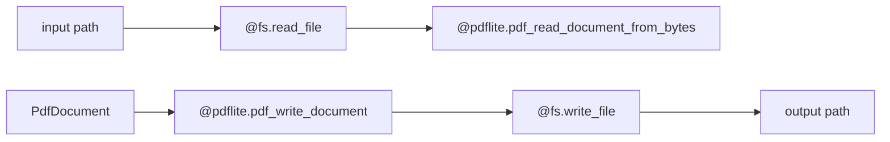

# pdflite/async_io

`bobzhang/pdflite/async_io` connects the root PDF reader and writer to
`moonbitlang/async/fs`. It is native-only and keeps filesystem concerns out of
the pure document package.



## Checked Examples

```moonbit check
///|
#cfg(target="native")
async fn readme_round_trip_minimum_pdf(path : String) -> Unit {
  if @fs.exists(path) {
    @fs.remove(path)
  }
  let document = try! @pdflite.pdf_minimum_valid_pdf()
  @async_io.pdf_write_document_to_file(document, path)
  inspect(@async_io.pdf_revisions_from_file(path), content="1")
  let parsed = @async_io.pdf_read_document_from_file(path)
  inspect(try! parsed.endpage(), content="1")
  @fs.remove(path)
}

///|
test "file helpers typecheck in an async round trip" {
  let _ = readme_round_trip_minimum_pdf
}
```

## Package Notes

- All public functions are `async` and native-target only.
- Read helpers mirror the root byte readers, including revision and password
  variants.
- Write helpers mirror classic, xref-stream, compressed-xref-stream, generated
  ID, and encrypted writer variants.

## Pedantic Boundaries

- This package owns filesystem IO glue only. PDF parsing, writing, repair, and
  encryption behavior must stay in `bobzhang/pdflite`.
- The package is native-only because it depends on `moonbitlang/async/fs`.
  Default wasm-gc tests are not the right verification target.
- Public functions read the entire file before passing bytes to the root reader.
  They do not provide streaming parse semantics.
- File creation permissions are passed to `@fs.write_file`; callers remain
  responsible for path choice and overwrite policy.

## Verification Notes

- README examples include native-gated code and should be validated with
  `moon test --target native async_io/README.mbt.md`.
- Add file round-trip tests when adding new read/write variants.
- Run native package tests before review because default-target checks will not
  cover this package.
