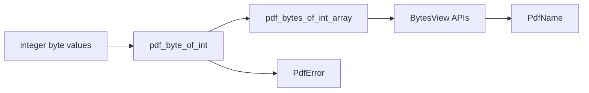

# pdflite/core

`bobzhang/pdflite/core` contains the byte primitives and shared error type used
by the rest of pdflite. It deliberately treats PDF data as `Bytes` and
`BytesView`; callers should decode text only at explicit text-decoding
boundaries.



## Checked Examples

```moonbit check
///|
test "byte helpers preserve raw PDF bytes" {
  let bytes = try! @core.pdf_bytes_of_int_array([37, 80, 68, 70])
  if @core.pdf_int_array_of_bytes(bytes) != [37, 80, 68, 70] {
    fail("expected raw PDF header bytes to be preserved")
  }
  inspect(@core.pdf_is_whitespace_byte(32), content="true")
  inspect(@core.pdf_is_delimiter_byte(47), content="true")
}
```

```moonbit check
///|
test "byte validation raises PdfError" {
  let result : Result[Byte, Error] = try @core.pdf_byte_of_int(300) catch {
    err => Err(err)
  } noraise {
    value => Ok(value)
  }
  guard result is Err(@core.PdfError::InvalidByte(300)) else {
    fail("expected InvalidByte for values outside 0..=255")
  }
}
```

## Package Notes

- `PdfBytes` is an alias for `Bytes` to make byte ownership visible at API
  boundaries.
- `PdfName` stores raw name bytes and exposes owned bytes and borrowed views.
- `PdfError` is shared by parsing, writing, filtering, text, page, and
  encryption APIs so higher packages can keep precise failure cases.

## Pedantic Boundaries

- This package owns raw PDF byte validation. Values outside `0..=255` must be
  rejected before they become `Byte`.
- This package does not parse PDF objects, streams, pages, fonts, or encryption
  dictionaries. It only supplies shared primitives for those packages.
- `BytesView` parameters are borrowed. Functions returning `PdfBytes` return
  owned data that can outlive the caller's source buffer.
- `PdfName` does not normalize, unescape, or Unicode-decode names. Higher
  layers decide when a name has semantic meaning.

## Verification Notes

- README examples are blackbox tests for the public `core` API.
- Add assertion tests for exact byte arrays and exact `PdfError` variants.
- Run `moon test core/README.mbt.md` after editing this file.
- Run `moon info` before review; this README should not change
  `core/pkg.generated.mbti`.
