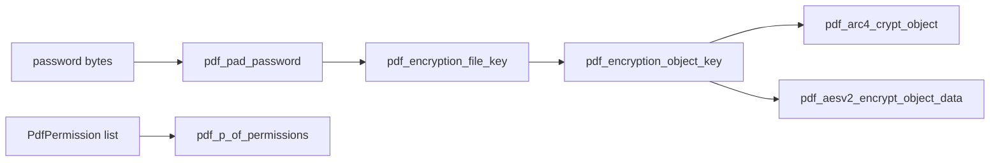

# pdflite/crypt_core

`bobzhang/pdflite/crypt_core` contains low-level PDF security-handler
primitives: ARC4, AES block and object encryption, password padding, digest
helpers, permission masks, file-key derivation, and object-key derivation. The
root package builds document-level encryption on top of these primitives.



## Checked Examples

```moonbit check
///|
test "arc4 primitive is symmetric" {
  let key = try! @core.pdf_bytes_of_int_array([1, 2, 3, 4, 5])
  let plain = try! @core.pdf_bytes_of_int_array([80, 68, 70])
  let cipher = try! @crypt_core.pdf_arc4_crypt(key, plain)
  let roundtrip = try! @crypt_core.pdf_arc4_crypt(key, cipher)
  if @core.pdf_int_array_of_bytes(roundtrip) != [80, 68, 70] {
    fail("expected ARC4 to decrypt back to the original bytes")
  }
}
```

```moonbit check
///|
test "digest and permission helpers expose PDF primitives" {
  let data = try! @core.pdf_bytes_of_int_array([97, 98, 99])
  inspect(@crypt_core.pdf_md5_digest(data).length(), content="16")
  let mask = @crypt_core.pdf_p_of_permissions([PdfNoPrint, PdfNoCopy])
  let permissions = @crypt_core.pdf_permissions_of_p(mask)
  let mut saw_copy = false
  for permission in permissions {
    if permission == PdfNoCopy {
      saw_copy = true
    }
  }
  if !saw_copy {
    fail("expected permission round trip to include PdfNoCopy")
  }
}
```

## Package Notes

- APIs accept byte views so higher packages can pass slices without copying.
- Permission helpers convert between explicit denied permissions and PDF `/P`
  bit masks.
- Object-encryption helpers require object number, generation, crypt type, key
  length, and file key so document-level code stays explicit.

## Pedantic Boundaries

- This package owns cryptographic primitives and PDF security-handler math. It
  does not parse encryption dictionaries or decide document write policy.
- Password inputs are byte views. Callers must decide how user-facing text is
  encoded before it reaches these APIs.
- Permission conversion preserves PDF's denied-permission semantics. Tests
  should name denied permissions explicitly instead of treating the `/P` integer
  as self-documenting.
- Object encryption must include object number, generation, crypt type, and key
  length so that callers cannot accidentally reuse a file key as an object key.

## Verification Notes

- README examples are blackbox tests for public low-level crypto APIs.
- Prefer published-vector tests and exact byte assertions in regular tests;
  README examples should stay small and deterministic.
- Run `moon test crypt_core/README.mbt.md` after editing this file.
- Run `moon info` before review; this README should not change
  `crypt_core/pkg.generated.mbti`.
