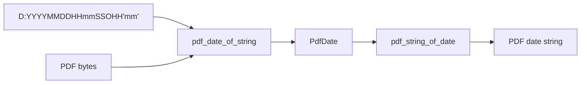

# pdflite/date

`bobzhang/pdflite/date` parses and writes PDF date strings. It keeps date fields
as integers so callers can inspect malformed or boundary data through `PdfError`
instead of relying on host time-zone behavior.



## Checked Examples

```moonbit check
///|
test "date strings round trip" {
  let input = "D:20240515112233+08'00'"
  let date = try! @date.pdf_date_of_string(input)
  inspect(try! @date.pdf_string_of_date(date), content=input)
}
```

```moonbit check
///|
test "bad date syntax raises shared PdfError" {
  let result : Result[@date.PdfDate, Error] = try? @date.pdf_date_of_string(
    "not a date",
  )
  guard result is Err(@core.PdfError::BadDate) else {
    fail("expected BadDate for malformed PDF date text")
  }
}
```

## Package Notes

- The parser accepts the PDF date grammar used by document metadata.
- `pdf_date_of_bytes`, `pdf_date_of_view`, and `pdf_date_of_string` share the
  same validation path.
- Writers return PDF bytes or strings so higher packages can store dates in
  objects without implicit Unicode conversion.

## Pedantic Boundaries

- This package owns PDF date syntax, not calendar arithmetic or host time-zone
  conversion.
- `PdfDate` stores numeric fields exactly as parsed or constructed. Callers are
  responsible for choosing meaningful dates before writing metadata.
- Malformed date text should raise `PdfError::BadDate`; tests should not accept
  ambiguous fallback dates.
- Byte-based entry points are the canonical boundary for PDF objects. String
  entry points are convenience wrappers for already-decoded ASCII-compatible
  date text.

## Verification Notes

- README examples are blackbox tests for the public date API.
- Add tests for both round trips and malformed input when changing parser rules.
- Run `moon test date/README.mbt.md` after editing this file.
- Run `moon info` before review; this README should not change
  `date/pkg.generated.mbti`.
