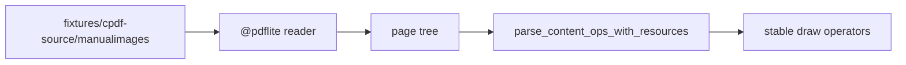

# pdflite/draw/fixture_acceptance

`bobzhang/pdflite/draw/fixture_acceptance` is a native-only acceptance package
for drawing PDFs copied from the cpdf source corpus. It probes the checked-in
manual-image PDFs under `fixtures/cpdf-source`.

## Package Notes

- The package is native-only because it reads checked-in source-corpus files
  from disk.
- Tests focus on cpdf-generated drawing output: line styles, dash patterns, text
  sections, Form XObject reuse, transparency resources, text-state parameters,
  path painting, clipping, colour operators, matrix save/restore, text clipping,
  and later drawing fixtures that warrant source-backed coverage.
- Library drawing and content APIs remain in the root package; this package is
  only for fixture-backed verification.

## Pedantic Boundaries

- Keep cpdf source-corpus artifacts in `fixtures/cpdf-source` with their
  upstream license note; do not duplicate them inside this package.
- Keep synthetic content parser edge cases in root `*_test.mbt` files where the
  bytes can be reviewed precisely.
- Assertions should check stable semantic operators rather than byte-identical
  cpdf output.
