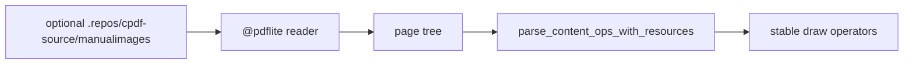

# pdflite/draw/fixture_acceptance

`bobzhang/pdflite/draw/fixture_acceptance` is a native-only acceptance package
for drawing PDFs generated by the optional `.repos/cpdf-source` checkout. It
probes cpdf manual-image PDFs when present and skips them in fresh clones where
the ignored source corpus is absent.

## Package Notes

- The package is native-only because it reads optional source-corpus files from
  disk.
- Tests focus on cpdf-generated drawing output: line styles, dash patterns, text
  sections, and later drawing fixtures that warrant source-backed coverage.
- Library drawing and content APIs remain in the root package; this package is
  only for fixture-backed verification.

## Pedantic Boundaries

- Do not vendor `.repos/cpdf-source` PDFs here; they are AGPL source-corpus
  artifacts and remain optional during porting.
- Keep synthetic content parser edge cases in root `*_test.mbt` files where the
  bytes can be reviewed precisely.
- Assertions should check stable semantic operators rather than byte-identical
  cpdf output.
