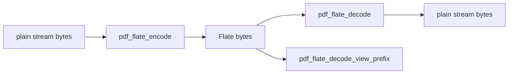

# pdflite/flate

`bobzhang/pdflite/flate` implements the Flate filter used by PDF streams. It
works on `Bytes` and `BytesView`, exposes default and level-controlled encoders,
and can decode one Flate stream prefix from a larger byte sequence.



## Checked Examples

```moonbit check
///|
test "flate round trips bytes" {
  let input = try! @core.pdf_bytes_of_int_array([
    104, 101, 108, 108, 111, 32, 112, 100, 102,
  ])
  let encoded = pdf_flate_encode(input)
  let decoded = try! pdf_flate_decode(encoded)
  if @core.pdf_int_array_of_bytes(decoded) !=
    [104, 101, 108, 108, 111, 32, 112, 100, 102] {
    fail("expected decoded bytes to match the original input")
  }
}
```

```moonbit check
///|
test "prefix decoder reports consumed compressed bytes" {
  let input = try! @core.pdf_bytes_of_int_array([65, 65, 65, 65, 65])
  let encoded = pdf_flate_encode(input)
  let (decoded, consumed) = try! pdf_flate_decode_view_prefix(encoded)
  if decoded != input || consumed != encoded.length() {
    fail("expected prefix decoder to consume the single encoded stream")
  }
}
```

## Package Notes

- Decode failures raise `PdfError::InvalidFlateData`.
- `BytesView` entry points avoid copying caller-owned stream data before decode.
- The native zlib stub is configured for the package, while the MoonBit fallback
  logic and guards remain covered by tests.

## Pedantic Boundaries

- This package owns the Flate byte filter only. PDF stream dictionaries,
  predictor parameters, and `/Filter` dispatch live in the root package.
- Decode APIs must reject malformed zlib/deflate data with
  `PdfError::InvalidFlateData`; partial success should be exposed only through
  explicit prefix APIs.
- Encoding level is an implementation choice except where a caller uses the
  level-controlled APIs. Correctness tests should assert round trips, not a
  particular compressed byte sequence.
- `pdf_flate_decode_view_prefix` is for consumers that need to parse one Flate
  stream from a longer byte buffer and therefore returns both decoded bytes and
  consumed length.

## Verification Notes

- README examples are blackbox tests for public Flate APIs.
- Keep exact-byte tests for decoded output and malformed-header tests in the
  package test suite.
- Run `moon test flate/README.mbt.md` after editing this file.
- Run `moon info` before review; this README should not change
  `flate/pkg.generated.mbti`.
