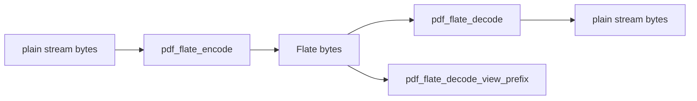

# pdflite/flate

`moonbitlang/pdflite/flate` adapts `moonbit-community/flate/zlib` for PDF streams. It
works on `Bytes` and `BytesView`, exposes default and level-controlled encoders,
and can decode one Flate stream prefix from a larger byte sequence.


```mermaid
flowchart LR
  Plain[plain stream bytes] --> Encode[pdf_flate_encode]
  Encode --> Compressed[Flate bytes]
  Compressed --> Decode[pdf_flate_decode]
  Compressed --> Prefix[pdf_flate_decode_view_prefix]
  Decode --> PlainOut[plain stream bytes]
```

## Checked Examples

```moonbit check
///|
test "flate round trips bytes" {
  let input = try! @core.pdf_bytes_of_int_array([
    104, 101, 108, 108, 111, 32, 112, 100, 102,
  ])
  let encoded = @flate.pdf_flate_encode(input)
  let decoded = try! @flate.pdf_flate_decode(encoded)
  if @core.pdf_int_array_of_bytes(decoded) !=
    [104, 101, 108, 108, 111, 32, 112, 100, 102] {
    fail("expected decoded bytes to match the original input")
  }
}
```

```moonbit check
///|
test "prefix decoder reports consumed compressed bytes" {
  let input = try! @core.pdf_bytes_of_int_array([65, 65, 65, 65, 65])
  let encoded = @flate.pdf_flate_encode(input)
  let (decoded, consumed) = try! @flate.pdf_flate_decode_view_prefix(encoded)
  if decoded != input || consumed != encoded.length() {
    fail("expected prefix decoder to consume the single encoded stream")
  }
}
```

## Package Notes

- Decode failures raise `PdfError::InvalidFlateData`.
- `BytesView` entry points avoid copying caller-owned stream data before decode.
- All targets use the same pure MoonBit community encoder and decoder.
- Decoding enforces a 1 GiB output limit (`FlateOutputLimitExceeded`).
- Empty input decodes to empty output. Decode ignores bytes after the first
  complete zlib stream, retaining the native decoder's PDF repair tolerance.
  Use the prefix API when the caller also needs the stream's encoded length.
- Compression levels outside 0–9 raise `InvalidFlateData`.
- Compressed bytes may differ from older miniz-based releases; the public
  signatures and decoded content are preserved.

## Pedantic Boundaries

- This package owns the Flate byte filter only. PDF stream dictionaries,
  predictor parameters, and `/Filter` dispatch live in the root package.
- Decode APIs must reject malformed zlib/deflate data with
  `PdfError::InvalidFlateData`. A stream must reach its end and pass checksum
  validation; bytes following that complete stream are tolerated for PDF repair.
- Encoding level is an implementation choice except where a caller uses the
  level-controlled APIs. Correctness tests should assert round trips, not a
  particular compressed byte sequence.
- `pdf_flate_decode_view_prefix` is for consumers that need to parse one Flate
  stream from a longer byte buffer and therefore returns both decoded bytes and
  consumed length.

## Verification Notes

- README examples are blackbox tests for public Flate APIs.
- Keep exact-byte tests for decoded output and malformed-header tests in the
  package test suite.
- Run `moon test flate/README.mbt.md` after editing this file.
- Run `moon info` before review; this README should not change
  `flate/pkg.generated.mbti`.
