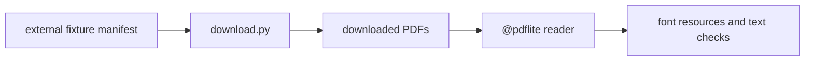

# pdflite/font/fixture_acceptance

`bobzhang/pdflite/font/fixture_acceptance` is a native-only acceptance package
for font-heavy external PDFs. It validates Type3 resources, CharProcs, font
encoding, text extraction, and reconstruction paths when optional downloaded
fixtures are available.



## Checked Examples

```moonbit check
///|
#cfg(target="native")
async test "font fixture manifest documents optional downloads" {
  let path = match @env.current_dir() {
    Some(current_dir) => current_dir + "/font/external_fixtures/manifest.json"
    None => "font/external_fixtures/manifest.json"
  }
  let manifest = @fs.read_file(path).text()
  if !manifest.contains("pdfium_bug_1591.pdf") ||
    !manifest.contains("cmp_itext_logo.pdf") {
    fail("expected font fixture manifest entries")
  }
}
```

## Package Notes

- The checked tests tolerate missing external downloads where appropriate.
- When downloads are present, the package exercises real-world Type3 font
  resources and malformed xref recovery.
- This package is test-only and should not become a library dependency.

## Pedantic Boundaries

- This package owns external font acceptance coverage only. Font parsing and
  text decoding remain in the root package.
- Downloaded fixtures are optional repository data. Tests must be useful in a
  fresh checkout and stricter when the files are present.
- Assertions should focus on stable PDF behavior: resource lookup, CharProcs,
  text bytes, rewrite survival, and malformed-startxref recovery.
- Do not add public APIs here; it is a native test package.

## Verification Notes

- README examples are native-only and should be validated with
  `moon test --target native font/fixture_acceptance/README.mbt.md`.
- Run the full package after downloading fixtures to exercise real PDFs.
- Manifest tests should verify fixture intent without requiring network access.
