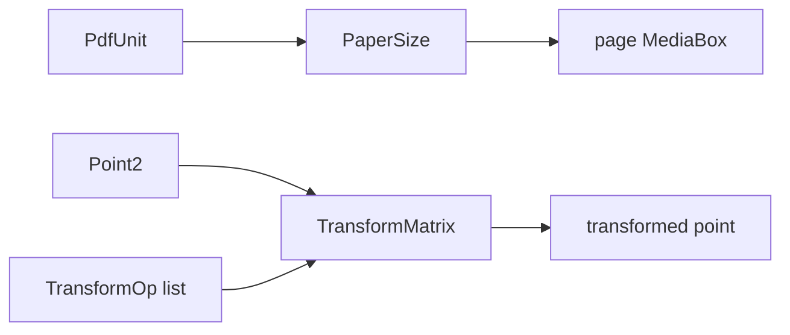

# pdflite/geometry

`bobzhang/pdflite/geometry` defines PDF units, paper sizes, 2D points, and
affine transform matrices. The root package re-exports these helpers for page
construction, but this package is the focused place for geometry-only code.



## Checked Examples

```moonbit check
///|
test "paper sizes and units are explicit" {
  if @geometry.paper_a4.unit() != @geometry.Millimetre {
    fail("A4 is stored in millimetres")
  }
  if @geometry.unit_points(1.0, @geometry.Inch) != 72.0 {
    fail("one inch is 72 PDF points")
  }
  let landscape = @geometry.paper_a4.landscape()
  if landscape.width() != 297.0 || landscape.height() != 210.0 {
    fail("landscape swaps paper width and height")
  }
}
```

```moonbit check
///|
test "transforms apply to points and render as PDF matrices" {
  let moved = @geometry.transform_translate(5.0, -10.0).apply(
    @geometry.point2(10.0, 20.0),
  )
  if moved.x != 15.0 || moved.y != 10.0 {
    fail("translation should move the point")
  }
  inspect(
    @geometry.transform_string_of_matrix(
      @geometry.transform_translate(5.0, -10.0),
    ),
    content="1, 0, 0, 1, 5, -10",
  )
}
```

## Package Notes

- `PaperSize` keeps both dimensions and their original unit.
- `TransformMatrix` uses the PDF six-number affine matrix layout.
- `TransformOp` preserves CamlPDF-style transform-list ordering for callers
  that build or inspect transformation pipelines.

## Pedantic Boundaries

- This package owns unit conversion and affine transform math only. It does not
  inspect page dictionaries, content streams, or resources.
- Units are explicit: `PaperSize` stores its source unit, while page code
  converts to PDF points when constructing `/MediaBox`.
- Transform matrices follow PDF's six-number convention `(a b c d e f)`.
  Composition order must be tested with points, not only by comparing matrix
  fields.
- Singular matrices raise the shared `PdfError::MatrixNotInvertable` through
  the `core` dependency.

## Verification Notes

- README examples are blackbox tests for public geometry APIs.
- Use exact assertions for simple unit conversions and tolerance-based tests for
  rotations or decompositions.
- Run `moon test geometry/README.mbt.md` after editing this file.
- Run `moon info` before review; this README should not change
  `geometry/pkg.generated.mbti`.
