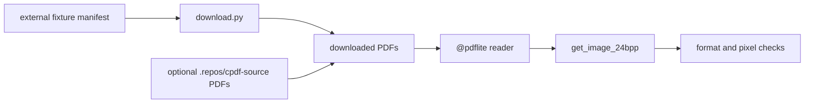

# pdflite/image/fixture_acceptance

`bobzhang/pdflite/image/fixture_acceptance` is a native-only acceptance package
for image-heavy external PDFs. It checks JPEG, CCITT, indexed color, compressed
rewrite, and xref reconstruction behavior when optional downloaded fixtures are
available. During porting it also probes optional `.repos/cpdf-source`
manual-image PDFs when that ignored source checkout is present.



## Checked Examples

```moonbit check
///|
#cfg(target="native")
async test "image fixture manifest documents optional downloads" {
  let path = match @env.current_dir() {
    Some(current_dir) => current_dir + "/image/external_fixtures/manifest.json"
    None => "image/external_fixtures/manifest.json"
  }
  let manifest = @fs.read_file(path).text()
  if !manifest.contains("pdflatex-image.pdf") ||
    !manifest.contains("imagemagick-CCITTFaxDecode.pdf") {
    fail("expected image fixture manifest entries")
  }
}
```

## Package Notes

- The package is native-only because it reads fixture files from disk.
- Optional external downloads let acceptance tests cover larger real-world
  images without bloating the repository.
- Optional `.repos/cpdf-source` fixtures are skipped when absent because that
  source checkout is ignored in fresh clones.
- Library image APIs remain in the root package; this package is only for
  fixture-backed verification.

## Pedantic Boundaries

- This package owns external image acceptance coverage only. Image decoding,
  color conversion, and PDF object parsing remain in the root package.
- Downloaded image PDFs and ignored `.repos/cpdf-source` source PDFs are
  optional. Checked README examples must not require network access,
  pre-downloaded binaries, or the ignored source checkout.
- Assertions should distinguish encoded image extraction from decoded RGB
  output, compressed rewrites, and xref reconstruction behavior.
- Do not add production helpers here; keep reusable image APIs in the root
  package.

## Verification Notes

- README examples are native-only and should be validated with
  `moon test --target native image/fixture_acceptance/README.mbt.md`.
- Run the full package after downloading fixtures to cover JPEG, CCITT, indexed
  color, and malformed-startxref cases.
- Manifest tests should stay stable even when fixture downloads are absent.
