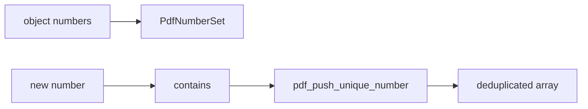

# pdflite/internal/number_set

`bobzhang/pdflite/internal/number_set` is a small mutable helper for tracking
object numbers during reconstruction, page cleanup, and xref processing. It is
internal because callers should normally work with document or page APIs rather
than managing object-number sets directly.



## Checked Examples

```moonbit check
///|
test "number set pushes only unseen values" {
  let seen = @number_set.pdf_number_set([2, 4])
  let output : Array[Int] = []
  @number_set.pdf_push_unique_number(output, seen, 2)
  @number_set.pdf_push_unique_number(output, seen, 5)
  @number_set.pdf_push_unique_number(output, seen, 5)
  if output != [5] {
    fail("expected only the first unseen number to be pushed")
  }
  inspect(seen.contains(4), content="true")
  inspect(seen.contains(5), content="true")
}
```

## Package Notes

- `PdfNumberSet::add` mutates the backing hash map.
- `pdf_push_unique_number` updates the set and appends only first-seen numbers.
- The package intentionally has no dependency on the public document model.

## Pedantic Boundaries

- This is an internal package. It should remain a low-level helper for
  algorithms that need object-number de-duplication.
- It owns set membership, not ordering policy. Ordering is determined by the
  caller's traversal and the output array passed to `pdf_push_unique_number`.
- Mutability is intentional: `PdfNumberSet` is a stateful visited-number set,
  not a persistent data structure.
- Do not add PDF document, page, or parser dependencies here; that would turn a
  utility package into a cycle risk.

## Verification Notes

- README examples are blackbox tests for the internal package API.
- Tests should cover duplicate suppression and mutation of the visited set.
- Run `moon test internal/number_set/README.mbt.md` after editing this file.
- Run `moon info` before review; this README should not change
  `internal/number_set/pkg.generated.mbti`.
