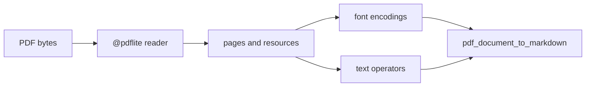

# pdflite/markdown

`bobzhang/pdflite/markdown` extracts readable Markdown text from PDF documents.
It parses page resources and content streams through the root package, decodes
font text where possible, and emits page-oriented Markdown.



## Checked Examples

```moonbit check
///|
fn readme_name(text : String) -> @pdflite.PdfName {
  @pdflite.pdf_name_of_bytes(@ascii.encode(text))
}

///|
fn readme_font_resources(font : @pdflite.PdfObject) -> @pdflite.PdfObject {
  @pdflite.pdf_dictionary([
    (
      readme_name("/Font"),
      @pdflite.pdf_dictionary([(readme_name("/F0"), font)]),
    ),
  ])
}

///|
test "extract text from an in-memory PDF" {
  let doc = @pdflite.pdf_document_empty()
  doc.set_version(1, 4)
  let font = try! @pdflite.pdf_make_font(
    readme_name("/Helvetica"),
    PdfWinAnsiEncoding,
  )
  let page = {
    ..@pdflite.pdf_page_blank(@pdflite.paper_a4),
    content: [
      try! @pdflite.pdf_content_stream_of_ops([
        Op_BT,
        Op_Tf(readme_name("/F0"), 12.0),
        Op_Tj(@ascii.encode("Hello from pdflite")),
        Op_ET,
      ]),
    ],
    resources: readme_font_resources(font),
  }
  let page_root = try! doc.add_pagetree([page])
  ignore(try! doc.add_root(page_root, []))
  let markdown = try! @markdown.pdf_document_to_markdown(doc)
  if !markdown.contains("Hello from pdflite") {
    fail("expected extracted text in Markdown output")
  }
}
```

## Package Notes

- `pdf_bytes_to_markdown` is the one-call API for callers with PDF bytes.
- `pdf_document_to_markdown` is useful when a document has already been parsed
  or modified in memory.
- The extractor is intentionally conservative around invalid text: tests cover
  control characters, replacement characters, CJK text, and damaged xrefs.

## Pedantic Boundaries

- This package owns text-oriented extraction to Markdown. It does not try to
  reproduce visual layout, tables, images, annotations, or accessibility tags.
- Text decoding follows the root package's font and content extraction helpers.
  Unknown or unsafe text should not become raw control characters in Markdown.
- Output is page-oriented. Page boundaries are represented as headings rather
  than hidden metadata.
- The extractor may recover text from damaged PDFs through the root reader's
  reconstruction path, but reconstruction behavior belongs to the root package.

## Verification Notes

- README examples are blackbox tests for the public Markdown API.
- Keep small in-memory examples here; larger fixture coverage belongs in
  `markdown/fixture_acceptance`.
- Run `moon test markdown/README.mbt.md` after editing this file.
- Run fixture acceptance tests when changing text extraction or font handling.
