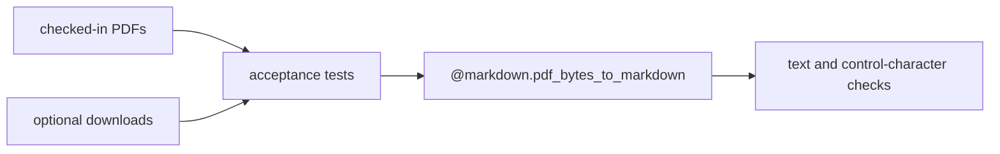

# pdflite/markdown/fixture_acceptance

`bobzhang/pdflite/markdown/fixture_acceptance` is a native-only test package for
Markdown extraction fixtures. It covers checked-in local PDFs and optional
downloaded external PDFs listed under `markdown/external_fixtures`.



## Checked Examples

```moonbit check
///|
#cfg(target="native")
async test "checked-in markdown fixture extracts expected text" {
  let path = match @env.current_dir() {
    Some(current_dir) => current_dir + "/markdown/fixtures/pandoc_latin.pdf"
    None => "markdown/fixtures/pandoc_latin.pdf"
  }
  let markdown = @markdown.pdf_bytes_to_markdown(@fs.read_file(path).binary())
  if !markdown.contains("Pandoc Latin Fixture") ||
    !markdown.contains("stable marker: alpha beta 123.") {
    fail("expected stable text from the Pandoc Latin fixture")
  }
}
```

## Package Notes

- Local fixture tests should be deterministic and always run in CI.
- External fixture tests are optional because downloaded PDFs may not be present
  in a fresh checkout.
- The package is native-only because fixture IO uses `moonbitlang/async/fs`.

## Pedantic Boundaries

- This package owns acceptance tests, not the Markdown extraction library.
- Checked-in fixtures are mandatory test inputs. Downloaded fixtures are
  optional and must be skipped or tolerated when absent.
- Assertions should check stable semantic markers, absence of raw control
  characters, and expected replacement-character counts where known.
- Do not make this package a dependency of library packages; the direction is
  fixture tests depending on libraries.

## Verification Notes

- README examples are native-only and should be validated with
  `moon test --target native markdown/fixture_acceptance/README.mbt.md`.
- Run the full fixture package when changing text extraction, xref recovery, or
  CJK handling.
- External fixture manifests and lock files document optional downloads; they
  are not required for the checked README example.
